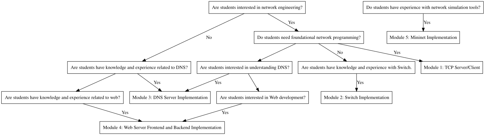

# Captive-Portal-Education

[Network Engineering Educational Path Finder Web Site](https://lianting-wang.github.io/Captive-Portal-Education/)

Network Engineering Educational Path Flowchart

## Guidelines for each modules:
  - [Guide for Setup Captive Portal Project](docs/Module0.md)
  - [Guide for TCP Server and Client Implementation](docs/Module1.md)
  - [Guide for Switch Implementation](docs/Module2.md)
  - [Guide for DNS Server Implementation](docs/Module3.md)
  - [Guide for Web Server Frontend and Backend Implementation](docs/Module4.md)
  - [Guide for Mininet Implementation](docs/Module5.md)
